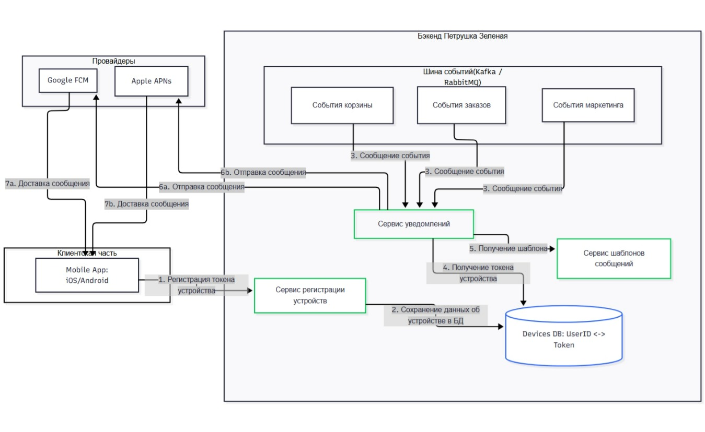

# Тестовое задание (Системный аналитик)
## *Задание 1: Анализ требований*

Описание:
Вам попал на руки фрагмент технического задания на разработку функционала "Корзина" для интернет-магазина "Петрушка Зеленая". В ТЗ есть несколько логических противоречий, недочетов и неполных мест.

Раздел ТЗ: Функционал корзины

1. Пользователь может добавить в корзину от 1 до 10 единиц одного товара.
2. Пользователь может изменить количество каждого товара в корзине не менее, чем до 1-го. Для удаления товара из корзины используется отдельная кнопка.
3. В корзине может находиться не более 5 различных товаров.
4. Суммарное количество всех товаров в корзине не может превышать 20 штук.
5. Товары в корзине могут быть разные.
6. При попытке добавить товар, превышающий лимиты, система показывает сообщение: "Лимит корзины превышен".
7. Цена на продукт фиксируется на момент добавления в корзину и не меняется.
8. На странице корзины отображается список товаров, их количество, цена за единицу и общая стоимость позиции.
9. Если пользователь уменьшает количество товара до 0, товар удаляется из корзины.
10. В корзине может быть реклама других продуктов.
11. Реклама товаров в корзине должна быть каждый будний день по утрам и вечерам.
12. Если цена на товар изменилась в каталоге, система должна автоматически обновить ее в корзине у всех пользователей.

Что нужно сделать:
1. Найдите и перечислите все логические противоречия и недочеты в предоставленном ТЗ. Объясните, в чем заключается проблема для каждого пункта.
2. Предложите конкретные исправления для устранения этих противоречий - напишите свою версию этого фрагмента ТЗ, которая должна быть логически завершенной и непротиворечивой.
3. Какие уточняющие вопросы вы бы задали продукт-менеджеру или бизнес-заказчику по этому ТЗ?

### *Выполнение задания 1:*

*1. Логические противоречия и недочеты:*
- Пункт 2 и 9 противоречат друг другу. Пункт 2 гласит: "Пользователь может изменить количество... не менее, чем до 1-го. Для удаления используется отдельная кнопка", но пункт 9 утверждает: "Если пользователь уменьшает количество до 0, товар удаляется". Это взаимоисключающие правила, необходимо выбрать единый принцип поведения - либо минимум 1 шт. с удалением через кнопку, либо возможность уменшения до 0 с автоматическим удалением.
- Пункт 7 и 12 противоречат друг другу. Невозможно одновременно фиксировать цену и обновлять её динамически, поэтому необходимо определить единое поведение цены в корзине, оставив 1 из 2 пунктов.
- Пункт 11 не ясен, не является функциональным требованием. Не заданы четкие временные рамки для определений "утро/вечер". Необходимо уточнить критерии и логику отключения/включения рекламы.
- Из пунктов 1, 3 и 4 следует неясность логического поведения. Не определена приорететность лимитов, т.е. какой лимит проверяется первым при добавлении товара. Также, из пункта 6 - сообщение "Лимит корзины превышен" не описывает конкретно какой лимит превышен.
- В ТЗ отсутствует логика поведения в случаях, например, когда товар закончился на складе после добавления в корзину.
- Не описаны уточнения касательно рекламы, т.е. её расположение, объём и наличие ограничений.

*2. Конкретные исправления ТЗ (в виде сравнений)*

|№ п.|Начальная версия ТЗ|Исправленная версия ТЗ|
|----|-------------------|----------------------|
|1. |Пользователь может добавить в корзину от 1 до 10 единиц одного товара.| Пользователь может добавить в корзину от 1 до 10 единиц одного товара за одну операцию. При попытке добавить товар, который уже есть в корзине, количество суммируется с текущим, но не может превысить 10 единиц.|
|2. |Пользователь может изменить количество каждого товара в корзине не менее, чем до 1-го. Для удаления товара из корзины используется отдельная кнопка.| Пользователь может изменить количество товара в корзине в диапазоне от 1 до 10 штук через элементы управления (кнопки +/- или ручной ввод). Установка количества в 0 через ручной ввод или нажатие кнопки «Удалить» приводит к немедленному удалению товара из корзины.|
|3. |В корзине может находиться не более 5 различных товаров.| В корзине может находиться не более 5 различных товаров (позиций). При попытке добавить 6-й уникальный товар система блокирует операцию и показывает сообщение: "В корзине может быть не более 5 различных товаров".|
|4. |Суммарное количество всех товаров в корзине не может превышать 20 штук.| Суммарное количество всех товаров в корзине не может превышать 20 штук. При попытке добавить товар, который приведет к превышению лимита, система блокирует операцию и показывает сообщение: «Суммарное количество товаров не может превышать 20 штук».|
|5. |Товары в корзине могут быть разные.| Пункт удален, т.к. не несет полезной функциональной нагрузки.|
|6. |При попытке добавить товар, превышающий лимиты, система показывает сообщение: "Лимит корзины превышен".| При попытке добавить товар, превышающий любой из лимитов, система показывает контекстное сообщение : "Нельзя добавить больше 10 шт. одного товара" - при превышении лимита на единицы товара; "В корзине может быть не более 5 различных товаров" - при превышении лимита на разнообразие; "Суммарное количество товаров не может превышать 20 штук" - при превышении общего лимита.|
|7. |Цена на продукт фиксируется на момент добавления в корзину и не меняется.|  Пункт удален, т.к. из пунктов 7 и 12 выбран приоритетным п.12.|
|8. |На странице корзины отображается список товаров, их количество, цена за единицу и общая стоимость позиции.| На странице корзины отображается список товаров, их количество, цена за единицу, общая стоимость позиции, итоговая сумма корзины и кнопки управления (изменение количества, удаление позиции).|
|9. |Если пользователь уменьшает количество товара до 0, товар удаляется из корзины.| Пункт удален, т.к. интегрирован в п.2.|
|10. |В корзине может быть реклама других продуктов.| В корзине допускается размещение до N рекламных блоков с рекомендациями товаров. Рекламные блоки отображаются под списком товаров и над итоговой суммой.|
|11. |Реклама товаров в корзине должна быть каждый будний день по утрам и вечерам.| Пункт удален, т.к. расписание это бизнес правило, а не функциональное требование. Функционал корзины обеспечивает только техническую возможность отображения рекламных блоков.|
|12. |Если цена на товар изменилась в каталоге, система должна автоматически обновить ее в корзине у всех пользователей.| Пункт не изменён, т.к. выбрано единое логическое поведение в сравнении с п.7.|

*3. Уточняющие вопросы заказчику*

1. Какая политика ценообразования приоритетна: фиксация цены (защита пользователя) или динамическое обновление (актуальность каталога)? Есть ли исключения для скидок/распродаж?
2. Как обрабатывать ситуацию, когда товар закончился на складе после добавления в корзину: блокировать оформление заказа, предлагать аналоги или удалять позицию автоматически?
3. Зачем привязывать показ рекламы к будним дням и времени суток? Это требование маркетинга или техническое ограничение?
4. Должна ли система предупреждать пользователя о приближении к лимитам до попытки добавления товара (прогресс-бар, подсказка)?
5. Нужна ли возможность «очистить корзину» одной кнопкой или сохранять историю удаленных товаров?
6. Как корзина взаимодействует с данными о наличии на складе (проверка остатков в реальном времени)?

## *Задание 2: проектирование API*

Описание:
Интернет-магазин "Петрушка Зеленая" преуспевает, расширяется и в мобильном приложении решили создать новый экран, который будет отображать магазины партнеров (см. макеты ниже).


Что нужно сделать:
Написать пример REST API запроса, который будет вызываться при переходе пользователя на данный экран. 
Привести пример ответа этого REST API в соответствии с макетом. Формат - JSON. Учесть, что при клике на плашку магазина должен осуществляться переход по ссылке на внешний ресурс. 

### *Выполнение задания 2:*
*1. Пример запроса REST API*

`GET /api/v1/partner-stores?latitude=55.7522&longitude=37.6156&user_city_id=77 HTTP/1.1
Host: api.petrushkazelenaya.ru
Authorization: Bearer <user_token>
Accept-Language: ru-RU
Accept: application/json
`

Пояснения:
- latitude, longitude — геокоординаты пользователя (для расчёта времени доставки)
- user_city_id — идентификатор города (для фильтрации актуальных партнёров)
- Accept-Language — для локализации названий и формата времени
- Authorization — для персонализации (токен авторизованного пользователя)

*2. Пример успешного ответа REST API*

```
{
  "status": "success",
  "data": {
    "stores": [
      {
        "id": "metro_001",
        "name": "METRO",
        "logo_url": "https://cdn.petrushkazelenaya.ru/logos/metro_logo_ru.png",
        "delivery_time_display": "Сегодня, 14:00",
        "delivery_time_iso": "2026-02-06T14:00:00+03:00",
        "external_link": "https://metro.ru?partner=petrushka&utm_source=mobile_app",
        "is_active": true
      },
      {
        "id": "auchan_002",
        "name": "Ашан",
        "logo_url": "https://cdn.petrushkazelenaya.ru/logos/auchan_logo_ru.png",
        "delivery_time_display": "Завтра, 10:00",
        "delivery_time_iso": "2026-02-07T10:00:00+03:00",
        "external_link": "https://auchan.ru/partners/petrushka",
        "is_active": true
      },
      {
        "id": "vkusvill_003",
        "name": "ВкусВилл",
        "logo_url": "https://cdn.petrushkazelenaya.ru/logos/vkusvill_logo_ru.png",
        "delivery_time_display": "от 20 до 60 минут",
        "delivery_time_iso": "2026-02-06T12:34:56+03:00",
        "external_link": "https://vkusvill.ru?ref=petrushka_app",
        "is_active": true
      },
      {
        "id": "victoria_004",
        "name": "Виктория",
        "logo_url": "https://cdn.petrushkazelenaya.ru/logos/victoria_logo_ru.png",
        "delivery_time_display": "Послезавтра, 09:00",
        "delivery_time_iso": "2026-02-08T09:00:00+03:00",
        "external_link": "https://victoria-market.ru/promo/petrushka",
        "is_active": true
      }
    ]
  },
  "meta": {
    "count": 4,
    "generated_at": "2026-02-06T12:34:56+03:00"
  }
}
```

## *Задание 3: архитектура*

Описание:
Заказчик хочет, что в мобильное приложение интернет-магазина "Петрушка Зеленая" начали приходить пуши. Они могут быть разными: о том, что заказ слишком долго лежит без действий в корзине, об отмене заказа, рекламные рассылки и прочее. То есть нужен функционал, а какие пуши отправлять - точно найдется.

Что нужно сделать:
Построить верхнеуровневую архитектурую схему - как должна работать отправка PUSH уведомлений в данном приложении. Можно просто в виде блок схем. Считаем, что на бэкенде микросервисная архитектура. В данном задании рекомендуется в интернете изучить архитектуры подобных решений.
Быть готовым на собеседовании обсудить эту схему.

### *Выполнение задания 3:*



*Алгоритм работы:*

1. Регистрация устройства. При запуске мобильное приложение получает уникальный токен от ОС (Google или Apple). Приложение отправляет этот токен и UserID в Сервис регистрации устройств.
2. Сервис регистрации устройств сохраняет связку в БД устройств, указывая тип ОС (iOS/Android). В БД мы храним связь «1 User — M устройств». Если у клиента iPhone и iPad, он получит уведомление на оба девайса.
3. Микросервисы (Заказы, Корзина, Маркетинг) отправляют сообщение в Шину событий. В сообщении содержится только суть: "Пользователь X, событие Y".
4. Сервис уведомлений считывает событие из шины и идет в БД устройств, чтобы найти все токены, привязанные к этому пользователю.
5. Сервис уведомлений обращается к Сервису шаблонов сообщений. На основе типа события выбирается нужный текст, в который подставляются данные (имя клиента, номер заказа).
6. Сервис уведомлений определяет тип ОС для каждого токена и отправляет запросы в соответствующие шлюзы — FCM для Android или APNs для iOS.
7. Подходящие провайдеры доставляют пуш на телефон пользователя.
